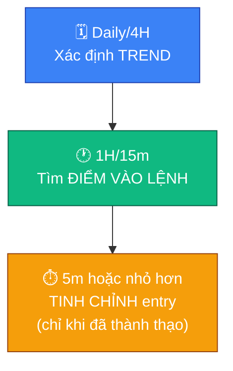

# 📊 Đọc nến & Chart cơ bản

## 🕯️ Nến Nhật (Candlestick)

Mỗi cây nến thể hiện 4 mức giá trong một khung thời gian: giá mở cửa (Open),
giá đóng cửa (Close), giá cao nhất (High), giá thấp nhất (Low).

- **Thân nến (body)**: khoảng cách giữa Open và Close.
  - 🟢 Nến xanh (tăng): Close > Open — phe mua thắng thế trong khung đó.
  - 🔴 Nến đỏ (giảm): Close < Open — phe bán thắng thế trong khung đó.
- **Râu nến (wick/shadow)**: phần giá đã chạm tới nhưng bị đẩy lùi lại, thể
  hiện vùng giá bị từ chối. Râu càng dài, mức độ giằng co/từ chối càng mạnh.
  - 🔽 Râu dài phía dưới: giá bị đẩy xuống rồi bật lại mạnh — dấu hiệu phe mua
    nhập cuộc, hoặc là cú "quét thanh khoản" (xem file 09).
  - 🔼 Râu dài phía trên: giá bị đẩy lên rồi bị bán lại mạnh — dấu hiệu phe bán
    nhập cuộc.
- **Thân nến dài, không râu (hoặc râu rất ngắn)**: xu hướng dứt khoát, một
  phe áp đảo hoàn toàn trong khung thời gian đó.

## 📏 Support & Resistance (S/R)

- 🟩 **Support (hỗ trợ)**: vùng giá mà lực mua từng đủ mạnh để chặn đà giảm,
  giá có xu hướng bật lên khi chạm tới.
- 🟥 **Resistance (kháng cự)**: vùng giá mà lực bán từng đủ mạnh để chặn đà
  tăng, giá có xu hướng bị đẩy xuống khi chạm tới.

> [!NOTE]
> S/R không phải một đường kẻ chính xác tuyệt đối mà là một **vùng giá** —
> giá thường xuyên "xuyên qua" một chút rồi mới phản ứng thật. Một vùng S/R
> bị phá vỡ dứt khoát (breakout) có thể đổi vai trò: hỗ trợ cũ trở thành
> kháng cự mới và ngược lại.

## 🕳️ Fair Value Gap (FVG) — cơ bản

FVG là một khoảng trống giá hình thành khi thị trường di chuyển quá nhanh
theo một hướng, để lại một "lỗ hổng" chưa được giao dịch cân bằng (thường
xác định bằng khoảng trống giữa bóng nến 1 và bóng nến 3 trong một chuỗi 3
nến di chuyển mạnh). Thị trường có xu hướng quay lại lấp đầy vùng FVG trước
khi tiếp tục xu hướng chính — nhiều trader dùng vùng này làm điểm chờ vào
lệnh theo xu hướng lớn thay vì đuổi giá.

> [!NOTE]
> FVG chỉ là một mảnh ghép nhỏ trong bức tranh lớn hơn về cách tổ chức/cá
> mập để lại dấu vết trên biểu đồ giá. Xem chi tiết ở
> [🧭 11-smart-money-concepts.md](11-smart-money-concepts.md) (Liquidity,
> Order Block, BOS/CHoCH, Premium/Discount zone).

## 📈 Xác định xu hướng (Trend)

- 📈 **Uptrend**: đáy sau cao hơn đáy trước, đỉnh sau cao hơn đỉnh trước.
- 📉 **Downtrend**: đỉnh sau thấp hơn đỉnh trước, đáy sau thấp hơn đáy trước.
- ➡️ **Sideway**: giá dao động trong một vùng, không tạo đỉnh/đáy mới rõ ràng.

> [!IMPORTANT]
> Luôn xác định trend ở khung thời gian **lớn hơn** (Daily/4H) trước khi tìm
> điểm vào lệnh ở khung nhỏ hơn — đây chính là câu hỏi số 1 trong checklist
> vào lệnh (file 04).

## 🔍 Đa khung thời gian (Multi-timeframe)

Nguyên tắc: dùng khung lớn để xác định **hướng đi** (trend), dùng khung nhỏ
hơn để tìm **điểm vào lệnh** có lợi (entry) theo đúng hướng đó.

| Khung | Vai trò |
|---|---|
| 🗓️ Daily / 4H | Xác định xu hướng chính, vùng S/R quan trọng |
| 🕐 1H / 15m | Tìm điểm vào lệnh cụ thể theo hướng của khung lớn |
| ⏱️ 5m hoặc nhỏ hơn | Tinh chỉnh điểm vào chính xác (chỉ dùng khi đã thành thạo, dễ nhiễu tín hiệu) |

> [!WARNING]
> Tránh chỉ nhìn một khung thời gian duy nhất — đây là nguyên nhân phổ biến
> khiến trader mới vào lệnh ngược xu hướng lớn mà không hề biết.
