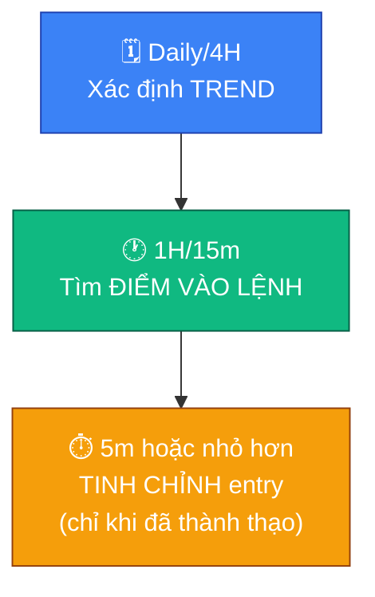

# 📊 Đọc nến & Chart cơ bản

## 🕯️ Nến Nhật (Candlestick)

Mỗi cây nến thể hiện 4 mức giá trong một khung thời gian: giá mở cửa (Open),
giá đóng cửa (Close), giá cao nhất (High), giá thấp nhất (Low).

- **Thân nến (body)**: khoảng cách giữa Open và Close.
  - 🟢 Nến xanh (tăng): Close > Open — phe mua thắng thế trong khung đó.
  - 🔴 Nến đỏ (giảm): Close < Open — phe bán thắng thế trong khung đó.
- **Râu nến (wick/shadow)**: phần giá đã chạm tới nhưng bị đẩy lùi lại, thể
  hiện vùng giá bị từ chối. Râu càng dài, mức độ giằng co/từ chối càng mạnh.
  - 🔽 Râu dài phía dưới: giá bị đẩy xuống rồi bật lại mạnh — dấu hiệu phe mua
    nhập cuộc, hoặc là cú "quét thanh khoản" (xem file 09).
  - 🔼 Râu dài phía trên: giá bị đẩy lên rồi bị bán lại mạnh — dấu hiệu phe bán
    nhập cuộc.
- **Thân nến dài, không râu (hoặc râu rất ngắn)**: xu hướng dứt khoát, một
  phe áp đảo hoàn toàn trong khung thời gian đó.

## 📶 Khối lượng giao dịch (Volume)

Volume là tổng khối lượng coin được mua bán trong một khung thời gian,
thường hiển thị dạng cột ngay dưới biểu đồ giá (cột xanh khi nến tăng, cột
đỏ khi nến giảm). Volume cho biết **có bao nhiêu người/tiền thật sự đứng sau
một cây nến** — một cây nến đẹp nhưng volume nhỏ giọt đáng tin cậy thấp hơn
nhiều so với cây nến cùng hình dạng nhưng volume tăng vọt.

- **Xác nhận breakout**: giá phá vỡ vùng S/R kèm volume tăng đột biến →
  breakout đáng tin. Phá vỡ với volume thấp → nghi ngờ false breakout, dễ bị
  đảo ngược lại ngay sau đó (xem "Quét hai đầu" ở file 09 và Liquidity Sweep
  ở file 11).
- **Volume climax**: volume đột biến cực lớn sau một chuỗi tăng/giảm dài
  thường là dấu hiệu kiệt sức (exhaustion) của xu hướng — khả năng đảo chiều
  hoặc điều chỉnh mạnh sắp tới.
- **Volume divergence**: giá tạo đỉnh/đáy mới nhưng volume của đợt đó lại
  giảm dần so với đợt trước → xu hướng đang yếu đi dù giá vẫn đang đi, cần
  thận trọng khi vào lệnh đuổi theo.

> [!TIP]
> Luôn nhìn volume song song với nến, đừng đọc nến một mình. Một cây nến
> phá vỡ mạnh nhưng volume nhỏ giọt thường là bẫy hơn là tín hiệu thật.

## 📏 Support & Resistance (S/R)

- 🟩 **Support (hỗ trợ)**: vùng giá mà lực mua từng đủ mạnh để chặn đà giảm,
  giá có xu hướng bật lên khi chạm tới.
- 🟥 **Resistance (kháng cự)**: vùng giá mà lực bán từng đủ mạnh để chặn đà
  tăng, giá có xu hướng bị đẩy xuống khi chạm tới.

> [!NOTE]
> S/R không phải một đường kẻ chính xác tuyệt đối mà là một **vùng giá** —
> giá thường xuyên "xuyên qua" một chút rồi mới phản ứng thật. Một vùng S/R
> bị phá vỡ dứt khoát (breakout) có thể đổi vai trò: hỗ trợ cũ trở thành
> kháng cự mới và ngược lại.

## 🕳️ Fair Value Gap (FVG) — cơ bản

FVG là một khoảng trống giá hình thành khi thị trường di chuyển quá nhanh
theo một hướng, để lại một "lỗ hổng" chưa được giao dịch cân bằng (thường
xác định bằng khoảng trống giữa bóng nến 1 và bóng nến 3 trong một chuỗi 3
nến di chuyển mạnh). Thị trường có xu hướng quay lại lấp đầy vùng FVG trước
khi tiếp tục xu hướng chính — nhiều trader dùng vùng này làm điểm chờ vào
lệnh theo xu hướng lớn thay vì đuổi giá.

> [!NOTE]
> FVG chỉ là một mảnh ghép nhỏ trong bức tranh lớn hơn về cách tổ chức/cá
> mập để lại dấu vết trên biểu đồ giá. Xem chi tiết ở
> [🧭 11-smart-money-concepts.md](11-smart-money-concepts.md) (Liquidity,
> Order Block, BOS/CHoCH, Premium/Discount zone).

## 📈 Xác định xu hướng (Trend)

- 📈 **Uptrend**: đáy sau cao hơn đáy trước, đỉnh sau cao hơn đỉnh trước.
- 📉 **Downtrend**: đỉnh sau thấp hơn đỉnh trước, đáy sau thấp hơn đáy trước.
- ➡️ **Sideway**: giá dao động trong một vùng, không tạo đỉnh/đáy mới rõ ràng.

> [!IMPORTANT]
> Luôn xác định trend ở khung thời gian **lớn hơn** (Daily/4H) trước khi tìm
> điểm vào lệnh ở khung nhỏ hơn — đây chính là câu hỏi số 1 trong checklist
> vào lệnh (file 04).

## 📉 Các chỉ báo kỹ thuật phổ biến (Indicators)

Chỉ báo kỹ thuật được tính toán từ giá/volume quá khứ — luôn là công cụ
**hỗ trợ đọc lại quá khứ (lagging)**, không dự đoán tương lai. Chia làm 3
nhóm theo cách hiển thị trên chart.

### 🔵 Nhóm vẽ đè lên biểu đồ giá (Overlay)

| Chỉ báo | Tên đầy đủ | Đo gì | Cách đọc nhanh |
|---|---|---|---|
| MA | Moving Average (đường trung bình động) | Xu hướng giá trung bình qua N kỳ | Giá nằm trên MA = thiên hướng tăng; MA ngắn cắt lên MA dài (golden cross) = tín hiệu tăng, cắt xuống (death cross) = tín hiệu giảm |
| BOLL | Bollinger Bands (dải Bollinger) | Biến động (volatility) quanh đường trung bình | Dải co hẹp lại = biến động thấp, chuẩn bị bùng nổ; giá chạm dải ngoài không tự động là đảo chiều, cần xác nhận thêm bằng nến/volume |
| SAR | Parabolic SAR | Điểm dừng & đảo chiều xu hướng | Chấm nằm dưới nến = đang uptrend, chấm nằm trên nến = đang downtrend; chấm nhảy sang phía đối diện = cảnh báo đổi xu hướng, hay dùng làm mốc trailing stop |
| AVL | Average Line | Đường trung bình giá rút gọn (một số sàn như Binance cung cấp riêng) | Đọc tương tự MA, dùng tham khảo xu hướng nhanh, không thay thế MA/EMA chuẩn |
| SuperTrend | SuperTrend (thường viết tắt SUPER/SUPPER) | Xu hướng dựa trên biên độ biến động thật ATR | Một đường bám sát giá, đổi màu xanh/đỏ khi xu hướng đổi chiều; đường này cũng thường dùng làm mốc trailing stop |

### 🟣 Nhóm dao động (Oscillator — hiển thị khung phụ riêng)

| Chỉ báo | Tên đầy đủ | Đo gì | Cách đọc nhanh |
|---|---|---|---|
| MACD | Moving Average Convergence Divergence | Động lượng qua chênh lệch giữa 2 đường EMA | Đường MACD cắt lên Signal = tín hiệu mua, cắt xuống = tín hiệu bán; Histogram co lại = động lượng yếu đi; phân kỳ MACD-giá = cảnh báo đảo chiều |
| RSI | Relative Strength Index | Tốc độ & độ lớn thay đổi giá, dao động 0-100 | Trên 70 = quá mua (overbought), dưới 30 = quá bán (oversold); phân kỳ RSI-giá là tín hiệu đáng chú ý |
| KDJ | Stochastic mở rộng (3 đường K, D, J) | Vị trí giá đóng cửa so với biên độ cao/thấp gần đây | J vượt mạnh ra ngoài khoảng 0-100 = tín hiệu cực đoan hơn K/D; J cắt K/D theo hướng nào thường báo hiệu theo hướng đó |
| WR | Williams %R | Tương tự Stochastic nhưng đảo trục, dao động 0 đến -100 | Gần 0 = quá mua, gần -100 = quá bán |

### 🟢 Nhóm khối lượng

| Chỉ báo | Tên đầy đủ | Đo gì | Cách đọc nhanh |
|---|---|---|---|
| OBV | On-Balance Volume | Dòng tiền tích luỹ qua volume theo hướng giá | OBV tăng cùng chiều với giá = xác nhận xu hướng; giá tạo đỉnh/đáy mới nhưng OBV không xác nhận (phân kỳ) = xu hướng đang yếu, cẩn trọng khi vào lệnh đuổi theo |

> [!WARNING]
> Không dùng một chỉ báo đơn lẻ để quyết định vào lệnh. Càng nhồi nhiều chỉ
> báo lên chart càng dễ rối tín hiệu ("indicator paralysis") — chọn tối đa
> 1-2 chỉ báo phù hợp phong cách của mình, dùng để **bổ trợ** cho nến, S/R,
> volume và cấu trúc thị trường (file 11), không thay thế checklist 5 câu
> hỏi ở [✅ 04-quy-tac-vao-lenh.md](04-quy-tac-vao-lenh.md).

## 🔍 Đa khung thời gian (Multi-timeframe)

Nguyên tắc: dùng khung lớn để xác định **hướng đi** (trend), dùng khung nhỏ
hơn để tìm **điểm vào lệnh** có lợi (entry) theo đúng hướng đó.

| Khung | Vai trò |
|---|---|
| 🗓️ Daily / 4H | Xác định xu hướng chính, vùng S/R quan trọng |
| 🕐 1H / 15m | Tìm điểm vào lệnh cụ thể theo hướng của khung lớn |
| ⏱️ 5m hoặc nhỏ hơn | Tinh chỉnh điểm vào chính xác (chỉ dùng khi đã thành thạo, dễ nhiễu tín hiệu) |

> [!WARNING]
> Tránh chỉ nhìn một khung thời gian duy nhất — đây là nguyên nhân phổ biến
> khiến trader mới vào lệnh ngược xu hướng lớn mà không hề biết.
