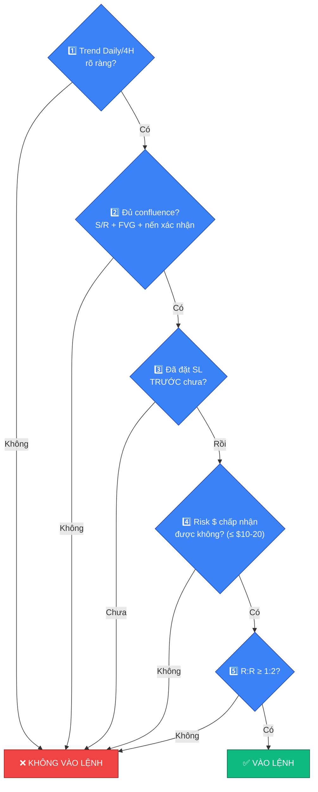

# ✅ Quy tắc vào lệnh — 5 câu hỏi bắt buộc

> [!IMPORTANT]
> Trước **mọi** lệnh, phải trả lời đầy đủ 5 câu hỏi sau. Nếu không trả lời
> được rõ ràng cả 5 câu → **không vào lệnh**, không có ngoại lệ.

## 🔀 Sơ đồ quyết định

## 1️⃣ Trend đang hướng nào? (Daily/4H)

Xác định xu hướng chính trên khung Daily và 4H trước tiên (xem
[📊 03-doc-nen-chart-co-ban.md](03-doc-nen-chart-co-ban.md)). Lệnh nên đi theo
hướng của trend lớn, không đánh ngược dòng trừ khi có tín hiệu đảo chiều rất
rõ ràng và đã có kinh nghiệm xử lý.

## 2️⃣ Setup có đủ confluence không? (S/R + FVG + Nến xác nhận)

Confluence nghĩa là nhiều yếu tố kỹ thuật cùng đồng thuận tại một vùng giá:
vùng Support/Resistance quan trọng, trùng với vùng Fair Value Gap, và có nến
xác nhận (nến đảo chiều rõ ràng, không phải nến giằng co mơ hồ). Một tín
hiệu đơn lẻ không đủ để vào lệnh — càng nhiều yếu tố hội tụ, xác suất setup
thành công càng cao.

## 3️⃣ SL đặt ở đâu? (Phải đặt TRƯỚC)

Điểm Stop-Loss phải được xác định và đặt lệnh **trước khi** vào lệnh, không
phải "vào rồi tính sau". SL nên đặt ở vị trí vô hiệu hóa setup (ví dụ: dưới
vùng đáy gần nhất nếu Long, trên vùng đỉnh gần nhất nếu Short) — không đặt
theo cảm tính hoặc theo số tiền muốn chịu lỗ.

## 4️⃣ Risk bao nhiêu $? Nếu giá đi ngược có chấp nhận được lỗ không?

Xác định trước số tiền sẵn sàng mất nếu SL bị chạm — khuyến nghị tối đa
$10-20 mỗi lệnh (hoặc theo % vốn cố định, xem
[🛡️ 05-quan-tri-rui-ro.md](05-quan-tri-rui-ro.md)). Nếu mức lỗ này khiến bạn
lo lắng hoặc ảnh hưởng đến tâm lý, khối lượng lệnh đang quá lớn — giảm size lại.

## 5️⃣ R:R có ít nhất 1:2 không?

Tỷ lệ Risk:Reward tối thiểu 1:2, nghĩa là mục tiêu lợi nhuận (TP) phải gấp
ít nhất 2 lần rủi ro (khoảng cách từ entry đến SL). Với R:R này, chỉ cần tỷ
lệ thắng trên 34% là đã có lợi nhuận dài hạn — không cần đoán đúng mọi lệnh.

---

## 🚫 Quy tắc bổ trợ

> [!CAUTION]
> **→ Nếu không trả lời đủ 5 câu → KHÔNG VÀO LỆNH.** Không có ngoại lệ vì
> "cảm thấy chắc ăn" hay "sợ bỏ lỡ".

> [!CAUTION]
> **Tuyệt đối không đoán đỉnh/đoán đáy, không cản đầu tàu** (không vào lệnh
> ngược một xu hướng đang cực mạnh chỉ vì "nghĩ nó sắp đảo chiều"). Luôn đi
> theo thị trường, không cố ép thị trường theo ý mình.
