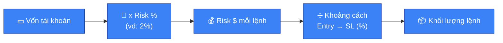

# 🛡️ Quản trị rủi ro

> [!IMPORTANT]
> Quản trị rủi ro quan trọng hơn khả năng phân tích kỹ thuật. Một trader với
> setup trung bình nhưng quản trị rủi ro tốt sẽ tồn tại lâu hơn một trader
> phân tích giỏi nhưng quản lý vốn kém.

## 💰 Risk tối đa mỗi lệnh

- Xác định trước một mức risk cố định cho mỗi lệnh: theo số tiền tuyệt đối
  (ví dụ tối đa $10-20/lệnh) hoặc theo % vốn tài khoản (thường khuyến nghị
  1-2% vốn/lệnh cho người mới).
- Risk ở đây là **số tiền mất nếu SL bị chạm**, không phải khối lượng lệnh.

> [!CAUTION]
> Không tăng risk để "gỡ nhanh" sau khi thua, và không tăng risk vì "đang tự
> tin" sau chuỗi thắng — cả hai đều là bẫy tâm lý (xem
> [🧠 06-tam-ly-fomo-bay.md](06-tam-ly-fomo-bay.md)).

## ⚖️ Tỷ lệ Risk:Reward (R:R)

- Luôn yêu cầu R:R tối thiểu **1:2** trước khi vào lệnh (mục tiêu lời gấp ít
  nhất 2 lần mức chấp nhận lỗ).
- Với R:R 1:2, tỷ lệ thắng chỉ cần trên ~34% là hệ thống đã có lời về dài
  hạn. Điều này giúp giảm áp lực phải "đoán đúng mọi lệnh".
- R:R càng cao (1:3, 1:4) thì yêu cầu về xác suất thắng càng thấp để hòa vốn
  — nhưng cũng khó đạt target hơn, cần cân bằng giữa hai yếu tố.

## 🛑 Đặt Stop-Loss và Take-Profit

- SL phải được đặt **trước khi** vào lệnh, dựa trên cấu trúc thị trường
  (dưới đáy gần nhất/trên đỉnh gần nhất), không dựa theo số tiền muốn mất.

> [!CAUTION]
> Không dời SL theo hướng bất lợi để "cho lệnh thêm cơ hội" — đây là cách
> nhanh nhất biến một khoản lỗ nhỏ thành một khoản lỗ lớn.

- ✅ Có thể dời SL theo hướng có lợi (trailing stop) khi lệnh đã đi đúng
  hướng, để bảo toàn lợi nhuận đã có.

## 🧮 Position Sizing (tính khối lượng lệnh)



Công thức cơ bản:

```
Khối lượng lệnh = Số tiền risk / Khoảng cách từ Entry đến SL (%)
```

Ví dụ: vốn $1,000, risk 2% = $20/lệnh. Nếu khoảng cách Entry–SL là 4%, khối
lượng lệnh tối đa = $20 / 4% = $500. Nếu dùng đòn bẩy, khối lượng ký quỹ cần
điều chỉnh tương ứng — nhưng số tiền risk thực tế ($20) không đổi.

> [!NOTE]
> **Lưu ý quan trọng**: đòn bẩy không làm tăng risk nếu size lệnh được tính
> đúng theo công thức trên — đòn bẩy chỉ quyết định cần bao nhiêu vốn ký quỹ
> để mở vị thế đó. Sai lầm phổ biến là dùng đòn bẩy cao để mở size lớn hơn mà
> không tính lại risk thực tế.

## 🏦 Quy tắc bảo toàn vốn

- 🚫 Không all-in một lệnh, dù setup có đẹp đến đâu — thị trường luôn có thể
  đi ngược dự đoán.
- ⛔ Đặt giới hạn lỗ tối đa trong ngày/tuần (ví dụ: dừng giao dịch nếu lỗ 5%
  vốn trong ngày) để tránh vòng xoáy gỡ vốn.
- 💸 Không giao dịch bằng tiền không thể chấp nhận mất, hoặc tiền vay mượn.
