# 🧠 Tâm lý giao dịch & Bẫy FOMO

> [!IMPORTANT]
> Phần lớn thua lỗ của trader mới không đến từ thiếu kiến thức kỹ thuật, mà
> từ việc vi phạm chính kế hoạch đã đặt ra vì cảm xúc. Nhận diện được các
> bẫy tâm lý dưới đây là bước đầu để tránh chúng.

## 🎢 Vòng lặp cảm xúc kinh điển của nhà đầu tư

```mermaid
flowchart LR
    A["😐 Thờ ơ"] --> B["🤔 Quan tâm"] --> C["🙂 Lạc quan"] --> D["🤩 Phấn khích"]
    D --> E["🔥 FOMO / Hưng phấn"] --> F["🥵 Mua đỉnh"]
    F --> G["😟 Lo lắng"] --> H["😨 Phủ nhận"] --> I["😱 Hoảng loạn / FUD"]
    I --> J["😡 Đầu hàng / Bán đáy"] --> K["😔 Chán nản"] --> A

    classDef greed fill:#ef4444,stroke:#991b1b,color:#fff
    classDef fear fill:#3b82f6,stroke:#1e40af,color:#fff
    classDef neutral fill:#6b7280,stroke:#374151,color:#fff
    class D,E,F greed
    class I,J,K fear
    class A,B,C,G,H neutral
```

*Cá mập thường mua vào ở vùng "chán nản/thờ ơ" và bán ra ở vùng "hưng phấn"
— ngược hoàn toàn với hành vi số đông nhỏ lẻ.*

## 🔥 FOMO (Fear Of Missing Out — Sợ bỏ lỡ)

- **Biểu hiện**: giá tăng mạnh liên tục, cảm giác "nếu không mua ngay sẽ bỏ
  lỡ cơ hội", mua đuổi ở vùng giá cao mà không có setup rõ ràng.
- **Vì sao nguy hiểm**: thường mua đúng lúc giá đã tăng nóng, gần đỉnh cục
  bộ — chính là lúc cá mập chuẩn bị xả hàng (xem bẫy tăng giá ở file 09).

> [!TIP]
> **Cách phòng tránh**: nhắc lại 5 câu hỏi ở file 04. Nếu vào lệnh chỉ vì
> "thấy giá tăng mà chưa vào", đó là FOMO, không phải một setup. Bỏ lỡ một
> cơ hội luôn tốt hơn vào một lệnh không có kế hoạch.

## 😨 FUD (Fear, Uncertainty, Doubt — Sợ hãi, hoang mang)

- **Biểu hiện**: giá giảm mạnh hoặc có tin xấu, hoảng loạn bán tháo ở vùng
  giá thấp dù chưa chạm SL đã đặt.
- **Vì sao nguy hiểm**: thường bán đúng đáy cục bộ, ngay trước khi giá hồi
  phục — nhất là trong các cú "bẫy giảm giá" (bear trap, xem file 09).

> [!TIP]
> **Cách phòng tránh**: nếu đã đặt SL đúng theo kế hoạch, để lệnh tự chạy
> đến SL hoặc TP. Không đóng lệnh sớm chỉ vì cảm xúc hoảng loạn nhất thời.

## 😡 Revenge Trading (Giao dịch trả thù)

- **Biểu hiện**: vừa thua một lệnh, lập tức vào lệnh mới với size lớn hơn để
  "gỡ lại nhanh", thường bỏ qua luôn checklist vào lệnh.

> [!CAUTION]
> Đây là cách nhanh nhất biến một khoản lỗ nhỏ, chấp nhận được, thành cháy
> tài khoản — vì quyết định được đưa ra trong trạng thái cảm xúc tiêu cực,
> không phải phân tích tỉnh táo.

- **Cách phòng tránh**: đặt quy tắc dừng giao dịch sau 2-3 lệnh thua liên
  tiếp trong ngày, rời khỏi màn hình một khoảng thời gian trước khi vào lệnh
  tiếp theo.

## 🔁 Overtrading (Giao dịch quá mức)

- **Biểu hiện**: vào lệnh liên tục vì buồn chán, vì "thị trường đang biến
  động nên phải làm gì đó", không phải vì có setup đủ confluence.
- **Vì sao nguy hiểm**: mỗi lệnh đều có chi phí (spread, phí giao dịch,
  funding rate) và rủi ro; càng giao dịch nhiều lệnh không có edge, kỳ vọng
  lợi nhuận dài hạn càng âm.
- **Cách phòng tránh**: giới hạn số lệnh tối đa mỗi ngày/tuần, chỉ vào lệnh
  khi đủ 5 câu hỏi ở file 04, chấp nhận có những ngày không giao dịch gì cả.

## 🪞 Confirmation Bias (Thiên kiến xác nhận)

- **Biểu hiện**: đã có sẵn ý kiến (ví dụ tin giá sẽ tăng), sau đó chỉ tìm và
  tin vào những thông tin/chỉ báo ủng hộ ý kiến đó, bỏ qua tín hiệu ngược
  lại.
- **Vì sao nguy hiểm**: dẫn đến giữ lệnh thua quá lâu, hoặc vào lệnh dựa
  trên "muốn nó đúng" thay vì dữ liệu khách quan.
- **Cách phòng tránh**: chủ động tìm lý do phản bác setup của chính mình
  trước khi vào lệnh — nếu không phản bác được, setup mới đủ vững.

## ⚓ Anchoring vào giá vốn / "gồng lỗ chờ về bờ"

- **Biểu hiện**: giữ lệnh thua rất lâu chỉ vì "chưa muốn cắt lỗ", hy vọng
  giá quay lại đúng giá vốn, bất chấp cấu trúc thị trường đã xấu đi.

> [!WARNING]
> SL tồn tại để giới hạn lỗ ở mức đã chấp nhận trước — phá vỡ nó nghĩa là để
> cảm xúc quyết định thay cho kế hoạch.

- **Cách phòng tránh**: coi SL là bất khả xâm phạm một khi đã đặt theo đúng
  quy trình ở file 04 và 05.

## ✅ Nguyên tắc chung để giữ kỷ luật

1. 📝 Viết checklist ra giấy/note, không làm trong đầu — cảm xúc dễ "lách
   luật" hơn khi không có gì ghi lại rõ ràng.
2. 📓 Ghi nhật ký mọi lệnh, kể cả lệnh thắng do may mắn (không theo kế
   hoạch) — xem [📓 10-nhat-ky-giao-dich.md](10-nhat-ky-giao-dich.md).
3. 🧘 Chấp nhận rằng thua lỗ là chi phí hoạt động bình thường của nghề
   trading, không phải thất bại cá nhân.
