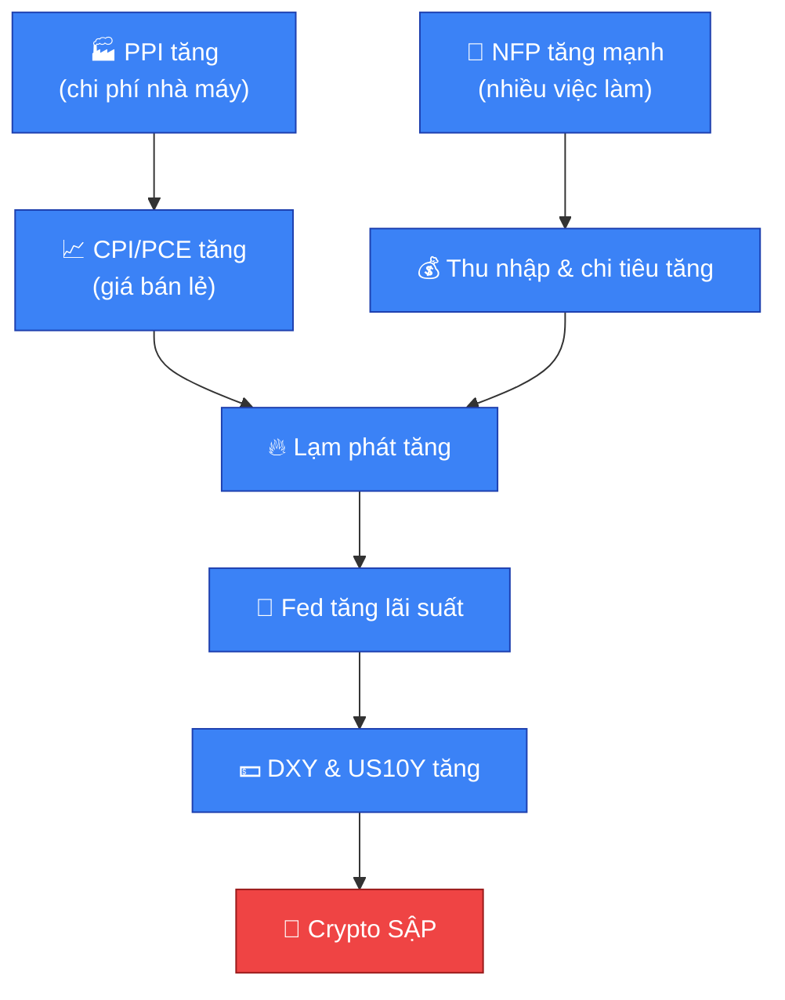

# 📅 Lịch vĩ mô & Sự kiện cần chú ý

Giá crypto không chỉ chịu ảnh hưởng bởi phân tích kỹ thuật mà còn bởi dòng
tiền vĩ mô toàn cầu. Nắm được các chỉ số dưới đây giúp tránh vào lệnh ngược
với "dòng chảy lớn" của thị trường.

## 🇺🇸 Bảng tổng hợp các chỉ số vĩ mô (Mỹ) & tác động đến Crypto

| Nhóm Chỉ Số | Tên Chỉ Số | Bản Chất Kinh Tế (Hiểu Đơn Giản) | Tác Động Khi Số Liệu TĂNG |
|---|---|---|---|
| 🏦 Bình Chứa Tiền | Fed Funds Interest Rate (Lãi suất Fed) | Chi phí vay tiền USD trực tiếp từ Ngân hàng Trung ương Mỹ | 🔴 Crypto SẬP (Tiền đắt, thanh khoản bị bóp nghẹt) |
| 📈 Lạm Phát Tiêu Dùng | Inflation Rate (Tỷ lệ lạm phát chung) | Tốc độ tăng giá tổng thể của nền kinh tế | 🔴 Crypto SẬP (Ép Fed phải giữ lãi suất cao) |
| 📈 Lạm Phát Tiêu Dùng | CPI (Chỉ số giá tiêu dùng) | Thước đo lạm phát dưới góc nhìn đi chợ, mua sắm của người tiêu dùng | 🔴 Crypto SẬP (Tin tức giật râu nến siêu bão) |
| 📈 Lạm Phát Tiêu Dùng | Core Inflation / Core CPI (Lạm phát lõi) | CPI đã loại bỏ giá Năng lượng và Thực phẩm (biến động thất thường) | 🔴 Crypto SẬP (Thước đo lạm phát ngầm, rất nguy hiểm) |
| 📈 Lạm Phát Tiêu Dùng | PCE / Core PCE | Thước đo thay đổi chi tiêu thực tế, chỉ số lạm phát yêu thích của Fed | 🔴 Crypto SẬP (Quyết định trực tiếp hành động của Fed) |
| 🏭 Lạm Phát Sản Xuất | PPI (Producer Prices Change) | Lạm phát đầu vào dưới góc nhìn của nhà sản xuất/nhà máy | 🔴 Crypto SẬP (Cảnh báo sớm, chạy trước CPI 1-2 tháng) |
| 👷 Thị Trường Lao Động | NFP (Bảng lương phi nông nghiệp) | Số việc làm mới tạo ra trong tháng (trừ nông nghiệp) | 🔴 Crypto SẬP (Kinh tế quá nóng, Fed diều hâu) |
| 💵 Dòng Tiền | DXY (Chỉ số sức mạnh USD) | Sức mạnh USD so với rổ 6 đồng tiền mạnh khác | 🔴 Crypto SẬP (Quan hệ ngược chiều ~90%) |
| 📉 Dòng Tiền | US10Y (Lợi suất trái phiếu Mỹ 10 năm) | Lợi nhuận "an toàn tuyệt đối" khi cho chính phủ Mỹ vay tiền | 🔴 Crypto SẬP (Hút dòng tiền về tài sản an toàn) |
| 🛢️ Năng Lượng | Baker Hughes Oil Rig Count (Mỹ) | Số giàn khoan dầu hoạt động tại Mỹ | 🟢 Crypto BAY (Dầu nhiều → giá dầu giảm → lạm phát giảm) |
| 🏗️ Sức Khỏe Kinh Tế | NY Empire State Manufacturing Index | Mức lạc quan/đơn hàng của nhà máy tại New York | 🔴 Crypto SẬP (Kinh tế quá khỏe → lo lạm phát dai dẳng) |
| 🏗️ Sức Khỏe Kinh Tế | Industrial Production MoM/YoY | Tổng sản lượng công nghiệp, nhà máy, khai khoáng Mỹ | 🔴 Crypto SẬP (Sản xuất mạnh → kinh tế nóng → Fed diều hâu) |

## 🌍 Bảng chỉ số các ngân hàng trung ương lớn

| Khu vực | Tên Chỉ Số | Bản Chất | Tác Động Khi TĂNG |
|---|---|---|---|
| 🇺🇸 Mỹ (Fed) | Fed Funds Rate | Chi phí vay USD — gốc rễ dòng tiền toàn cầu | 🔴 Cực kỳ xấu: quỹ rút tiền khỏi Crypto về gửi ngân hàng Mỹ lấy lãi an toàn |
| 🇯🇵 Nhật Bản (BOJ) | Policy Rate | Chi phí vay JPY — đồng tiền hay được mượn làm "vốn rẻ" | 🔴 Xấu ngắn hạn: phá vỡ Yen Carry Trade, quỹ phải bán Crypto trả nợ gấp |
| 🇨🇳 Trung Quốc (PBOC) | LPR (Loan Prime Rate) | Lãi suất định hình chi phí vay của doanh nghiệp/người dân TQ | 🔴 Xấu nếu tăng bất ngờ: bóp nghẹt dòng vốn ngầm Đông Á đổ vào Crypto |
| 🇪🇺 Châu Âu (ECB) | Refinancing Rate | Chi phí vay EUR của ngân hàng thương mại Eurozone | 🟡 Biến động: ngắn hạn EUR mạnh → DXY giảm → tốt cho BTC; dài hạn dòng vốn Âu vào Crypto bị thu hẹp |

## 🔗 Cơ chế tác động — vì sao các chỉ số này liên quan đến nhau

*Chuỗi nhân quả: PPI (sản xuất) tăng → chi phí nhà máy tăng → doanh nghiệp
tăng giá bán lẻ → CPI & PCE (tiêu dùng) tăng → Lạm phát tăng → Fed tăng lãi
suất → DXY/US10Y tăng → Crypto sập. NFP tăng mạnh cũng đổ vào cùng chuỗi này
qua kênh thu nhập/chi tiêu.*

### 1. Nhóm lạm phát (CPI, Inflation, Core Inflation, PCE, PPI)

Khi lạm phát tăng cao, tiền mất giá. Để cứu đồng tiền, Fed buộc phải tăng
lãi suất (thắt chặt dòng tiền). Vì vậy: **chỉ số lạm phát ra cao hơn dự báo
→ thị trường rủi ro như Crypto bị xả.**

### 2. Nhóm động cơ kinh tế (NFP)

NFP tăng mạnh = doanh nghiệp tuyển thêm người = dân có thu nhập = chi tiêu
nhiều hơn = kích thích lạm phát tăng. Để hạ nhiệt, Fed sẽ tăng lãi suất. Vì
vậy: **NFP tốt (tăng) = Crypto sập; NFP xấu (thất nghiệp tăng) = Fed sớm hạ
lãi suất = tiền rẻ quay lại = Crypto có thể bay.**

### 3. Nhóm thước đo dòng tiền (DXY, US10Y)

- 💵 **DXY**: Bitcoin định giá bằng USD. USD (DXY) tăng → cần ít USD hơn để
  mua 1 BTC → giá BTC giảm. DXY sập → thiên đường cho Crypto uptrend.
- 📉 **US10Y**: khi lợi suất trái phiếu quá cao (ví dụ trên 4.5%), quỹ lớn
  rút tiền khỏi kênh mạo hiểm (Altcoin) để mua trái phiếu an toàn. US10Y
  giảm → dòng tiền "đói lợi nhuận" tràn vào Crypto.

## 🧭 Mẹo thực chiến đọc lịch kinh tế (ForexFactory)

So sánh giữa số **Actual** (thực tế) và **Forecast** (dự báo):

- Tin lạm phát & lao động (CPI, PCE, PPI, NFP):
  - Actual > Forecast → USD tăng (DXY tăng) → Crypto SẬP 🔴
  - Actual < Forecast → USD giảm (DXY giảm) → Crypto BAY 🟢

> [!CAUTION]
> **Khi tin quan trọng sắp ra (đặc biệt CPI và NFP):**
> 1. Tránh vào lệnh trước tin 15 phút — cá mập thường dùng thuật toán quét
>    râu nến hai đầu (liquidation hunt) để giết lệnh đòn bẩy cao của nhỏ
>    lẻ, bất kể tin ra tốt hay xấu.
> 2. Đợi nến 15 phút sau khi tin ra đóng cửa, quan sát rõ Volume và hướng đi
>    thật của dòng tiền, rồi mới cân nhắc vào lệnh theo phe chiến thắng.
