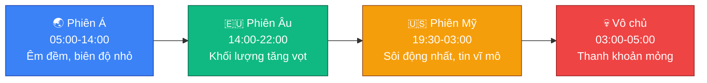

# 🕐 Khung giờ giao dịch

Thị trường crypto giao dịch 24/7, nhưng dòng tiền không phân bổ đều trong
ngày — nó di chuyển theo các phiên giao dịch truyền thống của thị trường tài
chính toàn cầu (Á, Âu, Mỹ). Biết khung giờ nào "sôi động" và khung giờ nào
"nguy hiểm" giúp tránh những cú quét thanh khoản bất ngờ.

## 🌐 Sơ đồ các phiên trong ngày (giờ VN, mùa Hè-Thu)

## ☀️ Khung giờ mùa Hè - Thu

| Phiên giao dịch | Giờ mở cửa (VN) | Giờ đóng cửa (VN) | Đặc điểm dòng tiền |
|---|---|---|---|
| 🌏 Phiên Á (Tokyo/Sydney) | 05:00 - 06:00 | 14:00 - 15:00 | Thị trường chạy êm, biên độ nhỏ, chủ yếu tích lũy hoặc phản ứng sớm với tin đêm trước |
| 🇪🇺 Phiên Âu (London/Frankfurt) | 14:00 | 22:00 | Khối lượng tăng vọt, xu hướng rõ ràng, xuất hiện các nhịp bẫy giá đầu ngày |
| 🇺🇸 Phiên Mỹ (New York) | 19:30 | 03:00 (sáng hôm sau) | Phiên sôi động và điên rồ nhất, quỹ ETF hoạt động, tin vĩ mô quan trọng (CPI, lãi suất) ra vào đầu phiên |

## ❄️ Khung giờ mùa Đông - Xuân

| Phiên giao dịch | Giờ mở cửa (VN) | Giờ đóng cửa (VN) |
|---|---|---|
| 🌏 Phiên Á | ~05:00 - 14:00 (ít thay đổi) | |
| 🇪🇺 Phiên Âu | 15:00 | 23:00 |
| 🇺🇸 Phiên Mỹ | 20:30 | 04:00 (sáng hôm sau) |

## 💀 Khung giờ "tử thần" cần đặc biệt lưu ý (Futures/Margin)

> [!CAUTION]
> **14:00 – 15:00 (Giao thoa Á – Âu)**: phiên Á chuẩn bị nghỉ, phiên Âu vào
> cuộc. Giá đang đi ngang lờ đờ cả sáng có thể giật mạnh một nhịp để thiết
> lập xu hướng cho buổi chiều.

> [!CAUTION]
> **19:30 – 21:00 (Giao thoa Âu – Mỹ)**: khung giờ nguy hiểm nhất trong
> ngày. Cả hai dòng tiền lớn cùng hoạt động, trùng giờ mở cửa chứng khoán
> Mỹ. Cú quét hai đầu (quét Long rồi mới tăng, hoặc ngược lại) thường xảy ra
> khốc liệt nhất trong 30-45 phút đầu của khung giờ này.

> [!CAUTION]
> **03:00 – 05:00 (sáng sớm giờ VN)**: phiên Mỹ đóng cửa, thị trường "vô
> chủ", thanh khoản mỏng. Cá mập thường lợi dụng lúc người chơi châu Á ngủ
> say để làm giá, tạo những cây râu nến rất dài mà không tốn nhiều chi phí.

## 🎯 Ứng dụng thực tế

- ✅ Người mới nên ưu tiên quan sát/giao dịch trong phiên Âu và đầu phiên Mỹ,
  nơi xu hướng rõ ràng hơn, tránh giao dịch chủ động trong khung giờ "tử
  thần" nêu trên.
- 🛡️ Nếu đã có lệnh mở qua các khung giờ giao thoa hoặc giờ thanh khoản
  mỏng, đảm bảo SL đã đặt đúng theo quy tắc ở
  [🛡️ 05-quan-tri-rui-ro.md](05-quan-tri-rui-ro.md) để không bị động trước
  biến động bất ngờ.
