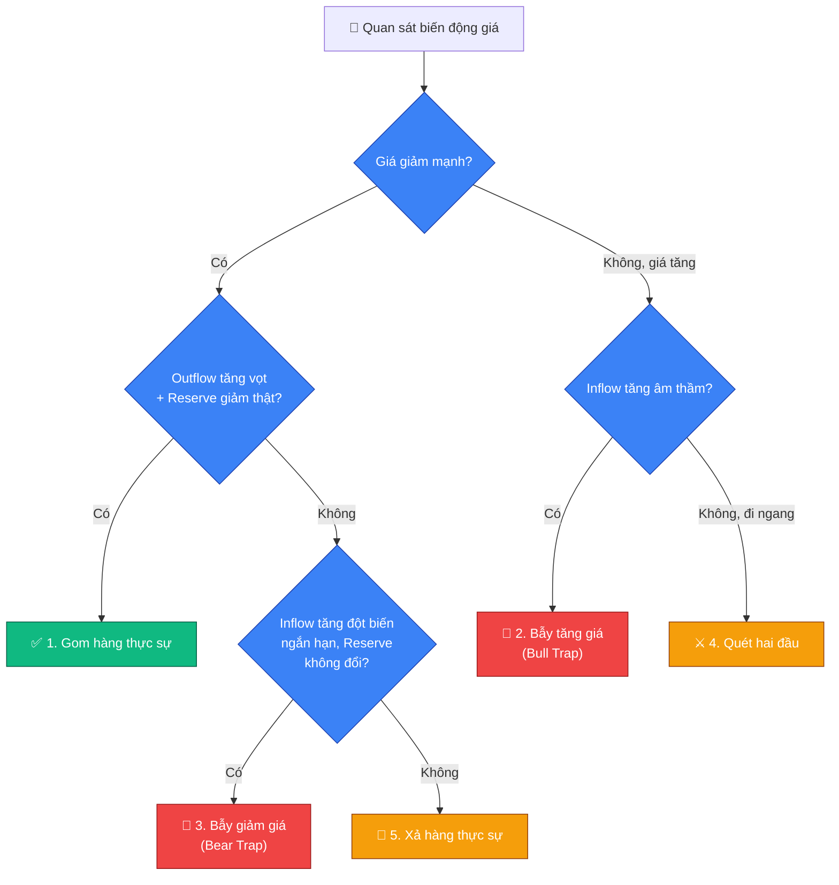

# 🐋 Đọc vị cá mập & On-chain cơ bản

## 📡 Các chỉ số on-chain/phái sinh cần biết trước

- **Exchange Inflow/Outflow**: dòng coin nạp vào (inflow) hoặc rút khỏi
  (outflow) các sàn giao dịch. Inflow tăng thường gắn với ý định bán; outflow
  tăng thường gắn với ý định gom giữ (rút về ví lạnh).
- **Exchange Reserve (Trữ lượng sàn)**: tổng lượng coin đang nằm trên các
  sàn. Xu hướng giảm dài hạn thường phản ánh nhà đầu tư rút coin về tự lưu
  trữ (tín hiệu tích lũy); tăng dài hạn phản ánh áp lực bán tiềm tàng.
- **Open Interest (OI)**: tổng giá trị các hợp đồng phái sinh (Futures) đang
  mở, chưa đóng. OI tăng nghĩa là tiền mới (thường là đòn bẩy) đang đổ vào
  thị trường; OI giảm mạnh thường đi kèm một đợt thanh lý hàng loạt.

## 🌳 Sơ đồ nhận diện kịch bản nhanh

## 📊 Bảng đọc vị tâm lý và hành vi cá mập

| Kịch bản | Đường Giá | Inflow/Outflow (Spot) | Exchange Reserve | Open Interest (OI) | Bản chất thực sự | Hành động khuyến nghị |
|---|---|---|---|---|---|---|
| ✅ 1. Gom hàng thực sự | Giảm mạnh rồi đi ngang | Outflow tăng vọt (cột xanh dựng đứng) | Giảm thực tế (đường tím chúi xuống) | Giảm mạnh rồi tạo đáy | Cá voi gom hàng thật + rũ bỏ đòn bẩy. Phe Long cũ đã bị thanh lý xong (OI giảm), cá voi mua giao ngay rồi rút về ví lạnh | 🟢 Cơ hội lớn — chia vốn ra gom (DCA đợt 1, đợt 2) |
| 🐂 2. Bẫy tăng giá (Bull Trap) | Tăng mạnh (xanh rực rỡ) | Inflow tăng âm thầm | Tăng lên hoặc giữ ở mức cao | Tăng vọt | Cá mập nạp coin lên để xả + kích thích FOMO. Giá tăng chủ yếu do phe đòn bẩy Long đuổi theo, trong khi cá mập chuẩn bị úp bô | 🔴 Nguy hiểm — tuyệt đối không mua đuổi (FOMO), cân nhắc chốt lời bớt |
| 🐻 3. Bẫy giảm giá (Bear Trap) | Giật râu nến giảm rất nhanh | Inflow tăng đột biến trong vài phút | KHÔNG tăng (hoặc giảm ngay sau đó) | Tăng mạnh | Cá mập "diễn kịch" nạp giả để dọa, khiến nhỏ lẻ hoảng loạn bán tháo, rồi dùng lệnh Short phái sinh ép giá xuống để gom hàng rẻ hơn | 🟡 Kiên nhẫn — không hoảng loạn bán tháo, đặt sẵn lệnh Limit chờ bắt râu nến |
| ⚔️ 4. Quét hai đầu | Đi ngang (sideway), giật râu khó chịu | Cả hai cùng GIẢM SÂU (đóng băng) | Đi ngang ở vùng đỉnh | Bắt đầu ngóc đầu tăng lại | Bẫy thanh khoản thấp — giao dịch Spot tạm dừng, cá mập chuyển sang phái sinh để giăng bẫy diệt lệnh Long/Short ngắn hạn của nhỏ lẻ | 🟡 An toàn là trên hết — ai ôm Spot dài hạn thì ngồi im, không chơi Futures/Margin giai đoạn này |
| 🌊 5. Xả hàng thực sự (Đại hồng thủy) | Giảm bền vững (nến thân dài, không râu) | Inflow tăng đều đặn | Tăng liên tục và giữ ở mức rất cao | Đi ngang hoặc giảm dần | Áp lực bán thật, kéo dài, không phải bẫy tạm thời | 🔴 Thận trọng — không bắt đáy sớm, chờ tín hiệu tạo đáy rõ ràng (giống kịch bản 1) trước khi giải ngân |

## 🧭 Nguyên tắc đọc vị chung

> [!IMPORTANT]
> Không nhìn một chỉ số đơn lẻ — phải đối chiếu **cả 4 yếu tố cùng lúc**
> (đường giá, inflow/outflow, exchange reserve, OI) mới phân biệt được bẫy
> thật hay tín hiệu thật.

> [!NOTE]
> Các cú giật râu nến bất thường, đặc biệt trong khung giờ thanh khoản mỏng
> (xem [🕐 08-khung-gio-giao-dich.md](08-khung-gio-giao-dich.md)), nhiều khả
> năng là hành vi săn thanh khoản hơn là biến động tự nhiên của thị trường.

> [!WARNING]
> Đây là công cụ hỗ trợ đọc bối cảnh, không thay thế cho quy tắc vào lệnh ở
> [✅ 04-quy-tac-vao-lenh.md](04-quy-tac-vao-lenh.md) — vẫn cần đủ confluence
> và quản trị rủi ro đúng cách trước khi hành động theo bất kỳ kịch bản nào.

## 🔗 Xem thêm: đọc vị qua price action

File này đọc vị smart money qua **dữ liệu blockchain thật** (inflow/outflow,
reserve, OI). Muốn đọc dấu vết smart money **trực tiếp trên biểu đồ giá**
(liquidity, Order Block, BOS/CHoCH...), xem
[🧭 11-smart-money-concepts.md](11-smart-money-concepts.md) — hai cách tiếp
cận này bổ trợ cho nhau, không thay thế nhau.
