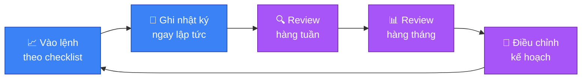

# 📓 Nhật ký giao dịch

> [!IMPORTANT]
> Ghi nhật ký là cách nhanh nhất để phát hiện lỗi lặp lại và cải thiện kỷ
> luật. Ghi cho **mọi** lệnh, kể cả lệnh thắng — một lệnh thắng không theo
> kế hoạch vẫn là một lỗi cần sửa, chỉ là may mắn che giấu nó.

## 🔄 Vòng lặp cải thiện liên tục

## 📝 Mẫu nhật ký cho mỗi lệnh

| Trường | Nội dung |
|---|---|
| 🗓️ Ngày/giờ vào lệnh | |
| 🪙 Cặp coin | |
| ↕️ Hướng lệnh | Long / Short |
| 1️⃣ Trend Daily/4H | |
| 2️⃣ Confluence (S/R + FVG + nến xác nhận) | |
| 3️⃣ Vị trí SL (đặt trước) | |
| 4️⃣ Risk $ chấp nhận | |
| 5️⃣ R:R dự kiến | |
| 🎯 Giá vào lệnh (Entry) | |
| 🛑 Giá SL | |
| ✅ Giá TP | |
| 🏁 Kết quả (Thắng/Thua/Hòa) | |
| ⚖️ R:R thực tế đạt được | |
| 📋 Lệnh có tuân thủ đúng 5 câu hỏi không? | Có / Không |
| 🎭 Cảm xúc lúc vào lệnh | (Bình tĩnh / FOMO / Sợ hãi / Revenge trading...) |
| 💡 Bài học rút ra | |

## ✅ Checklist review định kỳ

### 📆 Hàng tuần

- [ ] Có lệnh nào vi phạm quy tắc 5 câu hỏi không? Vi phạm câu nào nhiều nhất?
- [ ] Tỷ lệ thắng/thua và R:R trung bình thực tế là bao nhiêu?
- [ ] Có lệnh nào bị chi phối bởi FOMO, FUD, hoặc revenge trading không?
- [ ] Có dời SL bất lợi lần nào không?

### 🗓️ Hàng tháng

- [ ] So sánh hiệu suất tháng này với tháng trước — cải thiện hay đi xuống?
- [ ] Setup nào (loại confluence nào) cho tỷ lệ thắng cao nhất? Tập trung
  nhiều hơn vào setup đó.
- [ ] Có đang tăng risk/size một cách cảm tính không (sau chuỗi thắng hoặc
  thua)?
- [ ] Có cần điều chỉnh lại mức risk mỗi lệnh hoặc R:R tối thiểu không?

## 🎯 Nguyên tắc dùng nhật ký hiệu quả

> [!TIP]
> Ghi ngay sau khi đóng lệnh, đừng để dồn — cảm xúc và lý do thật dễ bị
> quên hoặc bị "chỉnh sửa" theo kết quả cuối cùng (hindsight bias).

> [!IMPORTANT]
> Trung thực tuyệt đối, kể cả khi lệnh thắng nhưng vi phạm quy tắc — mục
> tiêu là sửa hành vi, không phải khoe thành tích.

- 🔁 Định kỳ đọc lại nhật ký cũ để nhận ra các lỗi lặp lại theo thời gian —
  đây thường là dấu hiệu của một bẫy tâm lý cụ thể (xem
  [🧠 06-tam-ly-fomo-bay.md](06-tam-ly-fomo-bay.md)) chưa được xử lý triệt để.
