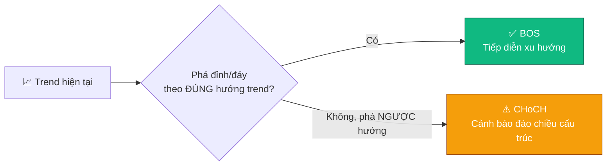
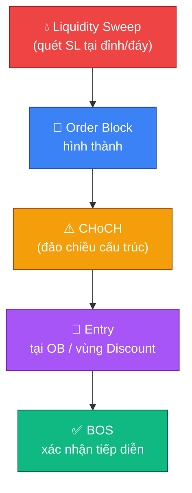

# 🧭 Smart Money Concepts (SMC)

SMC là trường phái đọc dấu vết của "dòng tiền thông minh" (tổ chức, quỹ, cá
mập, market maker) trực tiếp trên biểu đồ giá (price action) — khác với đọc
vị qua dữ liệu blockchain đã học ở
[🐋 09-doc-vi-ca-map-onchain.md](09-doc-vi-ca-map-onchain.md). Cả hai bổ trợ
cho nhau: on-chain cho biết *ai đang làm gì với coin thật*, còn SMC cho biết
*dấu vết đó thể hiện như thế nào trên đồ thị giá*.

## 🐋 Smart Money là ai?

- **Market maker / quỹ tổ chức / cá mập**: nhóm có vốn đủ lớn để tạo ra
  biến động giá thật, thay vì chỉ phản ứng theo giá như nhỏ lẻ.
- **"Dumb money"**: phần lớn nhỏ lẻ giao dịch theo cảm xúc — FOMO khi giá
  tăng, hoảng loạn khi giá giảm (xem [🧠 06-tam-ly-fomo-bay.md](06-tam-ly-fomo-bay.md)).
  SMC về bản chất là học cách **không hành xử như dumb money**, và tìm dấu
  vết để đi theo hướng smart money thực sự đang đẩy giá.

> [!NOTE]
> SMC không phải "biết trước" smart money làm gì — mà là đọc lại **dấu vết**
> họ để lại sau khi hành động, rồi chờ giá xác nhận trước khi vào lệnh.

## 📐 Market Structure cơ bản

- **Uptrend**: chuỗi đỉnh sau cao hơn đỉnh trước (Higher High - HH) và đáy
  sau cao hơn đáy trước (Higher Low - HL).
- **Downtrend**: chuỗi đỉnh sau thấp hơn đỉnh trước (Lower High - LH) và
  đáy sau thấp hơn đáy trước (Lower Low - LL).
- **Swing High/Swing Low**: các đỉnh/đáy cục bộ dùng làm mốc để xác định
  toàn bộ cấu trúc trên. Đây là nền tảng bắt buộc trước khi học các khái
  niệm bên dưới — nếu chưa vững, xem lại
  [📈 Xác định xu hướng ở 03-doc-nen-chart-co-ban.md](03-doc-nen-chart-co-ban.md#-xác-định-xu-hướng-trend).

## 💧 Liquidity (Thanh khoản)

- **Buy-side liquidity**: nằm phía trên các đỉnh gần nhất — nơi dồn lệnh
  Stop-Loss của phe Short (đặt SL trên đỉnh) và lệnh chờ mua đuổi breakout.
- **Sell-side liquidity**: nằm phía dưới các đáy gần nhất — nơi dồn lệnh
  Stop-Loss của phe Long.

> [!IMPORTANT]
> Giá có xu hướng bị đẩy về các vùng liquidity này để "quét" (liquidity
> sweep/grab) trước khi đảo chiều thật — đây chính là cơ chế đứng sau kịch
> bản "Quét hai đầu" và "Bẫy giảm giá/tăng giá" đã học ở
> [🐋 09-doc-vi-ca-map-onchain.md](09-doc-vi-ca-map-onchain.md). Một cú quét
> thanh khoản không có nghĩa là đảo chiều — cần chờ xác nhận cấu trúc (BOS/CHoCH bên dưới).

## 🧱 Order Block (OB)

Vùng nến cuối cùng (thường ngược hướng) ngay trước một cú di chuyển giá
mạnh, dứt khoát — được coi là dấu vết tổ chức đặt lệnh lớn tại đó.

- **Bullish OB**: nến giảm cuối cùng trước một đợt tăng mạnh → vùng tổ chức
  có thể đã mua vào.
- **Bearish OB**: nến tăng cuối cùng trước một đợt giảm mạnh → vùng tổ chức
  có thể đã bán ra.

> [!WARNING]
> Order Block dễ bị vẽ chủ quan (mỗi người xác định một vùng khác nhau).
> Chỉ nên coi là một yếu tố **confluence**, không phải tín hiệu độc lập —
> xem mục "Kết hợp vào checklist" bên dưới.

## 🔨 Breaker Block

Một Order Block bị phá vỡ hoàn toàn (giá xuyên qua và đóng cửa ngược
hướng), sau đó đổi vai trò: Bullish OB bị phá thành kháng cự, Bearish OB bị
phá thành hỗ trợ. Cùng nguyên tắc "vùng S/R đổi vai trò khi bị phá vỡ dứt
khoát" đã nêu ở [📏 03-doc-nen-chart-co-ban.md](03-doc-nen-chart-co-ban.md).

## 🔄 BOS (Break of Structure) vs CHoCH (Change of Character)

- **BOS (Break of Structure)**: giá phá vỡ đỉnh/đáy theo đúng hướng trend
  hiện tại → xác nhận xu hướng tiếp diễn.
- **CHoCH (Change of Character)**: giá phá vỡ cấu trúc theo hướng **ngược**
  với trend hiện tại lần đầu tiên → tín hiệu cảnh báo sớm khả năng đảo
  chiều, cần theo dõi sát thay vì vào lệnh ngay.

## 💰 Premium / Discount Zone

Chia khoảng dao động giá gần nhất (từ swing low đến swing high) theo mức
50% (Fibonacci retracement):

- **Premium zone (nửa trên, vùng "đắt")**: ưu tiên tìm setup Short, tránh
  mua đuổi (Long) tại đây.
- **Discount zone (nửa dưới, vùng "rẻ")**: ưu tiên tìm setup Long, tránh
  bán đuổi (Short) tại đây.

> [!TIP]
> Nguyên tắc đơn giản: **mua rẻ (discount), bán đắt (premium)** theo đúng
> hướng trend chính — không mua/bán chỉ vì giá "có vẻ" hời mà bỏ qua trend
> ở file 03.

## 🎣 Inducement

Một bẫy thanh khoản nhỏ, đặt ngay trước vùng Order Block/liquidity thật, để
dụ nhỏ lẻ vào lệnh sai hướng hoặc thoát lệnh sớm — trước khi giá mới thực sự
di chuyển theo hướng smart money nhắm tới. Về bản chất, đây là phiên bản
price-action của "bẫy diễn kịch" đã mô tả ở kịch bản Bear Trap/Bull Trap tại
file 09.

## 🩹 Mitigation

Khi giá quay lại một Order Block cũ để "hoàn tất" các lệnh tổ chức chưa
khớp hết, trước khi tiếp tục di chuyển theo xu hướng chính — đây thường là
điểm vào lệnh có R:R tốt vì SL có thể đặt sát ngay sau vùng Order Block.

## 🔗 Chu trình SMC điển hình

## ✅ Kết hợp SMC vào checklist vào lệnh hiện có

> [!IMPORTANT]
> SMC **không thay thế** 5 câu hỏi bắt buộc ở
> [✅ 04-quy-tac-vao-lenh.md](04-quy-tac-vao-lenh.md) — nó làm rõ hơn câu
> hỏi số 2 ("Setup có đủ confluence không?"). Một setup SMC vững cần tối
> thiểu: Liquidity sweep đã xảy ra + Order Block hợp lệ + CHoCH/BOS xác nhận
> + nằm đúng vùng Premium/Discount theo hướng trend. Thiếu một trong các yếu
> tố này, coi như confluence chưa đủ — quay lại quy tắc "không đủ 5 câu hỏi
> → không vào lệnh".

> [!CAUTION]
> Rủi ro phổ biến nhất khi mới học SMC: tự vẽ Order Block/liquidity theo ý
> muốn để "hợp lý hóa" một lệnh đã muốn vào từ trước — đây chính là
> confirmation bias đã cảnh báo ở
> [🪞 06-tam-ly-fomo-bay.md](06-tam-ly-fomo-bay.md#-confirmation-bias-thiên-kiến-xác-nhận).
> Luôn chủ động tìm lý do phản bác vùng OB mình vừa vẽ trước khi tin vào nó.
