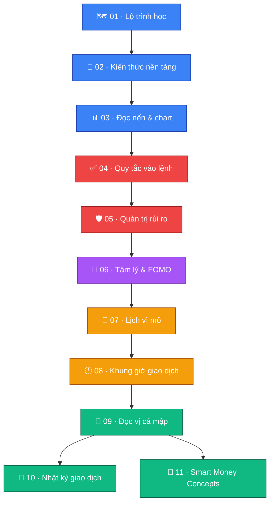

# 🚀 Crypto Trading Basics — Bộ tài liệu cho người mới

Bộ tài liệu này gom toàn bộ kiến thức cần thiết cho một trader crypto mới bắt
đầu: từ kiến thức nền, cách đọc chart, phân tích vĩ mô, tâm lý giao dịch, cho
tới quy tắc vào lệnh và quản trị rủi ro. Nội dung được chia nhỏ theo từng chủ
đề để dễ đọc và dễ quay lại tra cứu.

## 🔑 Chú giải ký hiệu dùng xuyên suốt bộ tài liệu

> [!NOTE]
> Thông tin bổ sung, kiến thức nền — đọc để hiểu bối cảnh.

> [!TIP]
> Mẹo thực chiến — áp dụng được ngay để giao dịch tốt hơn.

> [!IMPORTANT]
> Quy tắc bắt buộc — bỏ qua đồng nghĩa với việc phá vỡ kỷ luật giao dịch.

> [!WARNING]
> Rủi ro cần cẩn trọng — dễ mắc phải nếu chủ quan.

> [!CAUTION]
> Nguy hiểm cao / có thể cháy tài khoản — tuyệt đối tránh.

Icon 🔴 = xấu cho Crypto, 🟢 = tốt cho Crypto, 🟡 = tuỳ bối cảnh — dùng nhất
quán trong các bảng vĩ mô ở file 07.

## 🗺️ Sơ đồ lộ trình học

🔵 Nền tảng → 🔴 Quy tắc & rủi ro (quan trọng nhất) → 🟣 Tâm lý → 🟠 Vĩ mô/thời
điểm → 🟢 Kỹ năng nâng cao.

## 📚 Mục lục

| # | File | Nội dung |
|---|---|---|
| 1 | [🗺️ Lộ trình học](01-lo-trinh-hoc.md) | Checklist tổng quan cần học gì, theo thứ tự nào |
| 2 | [🧱 Kiến thức nền tảng](02-kien-thuc-nen-tang.md) | Loại lệnh, spot/margin/futures, đòn bẩy, ví & bảo mật |
| 3 | [📊 Đọc nến & chart cơ bản](03-doc-nen-chart-co-ban.md) | Nến Nhật, S/R, FVG, đa khung thời gian |
| 4 | [✅ Quy tắc vào lệnh](04-quy-tac-vao-lenh.md) | 5 câu hỏi bắt buộc trước mỗi lệnh |
| 5 | [🛡️ Quản trị rủi ro](05-quan-tri-rui-ro.md) | Risk/lệnh, R:R, position sizing, SL/TP |
| 6 | [🧠 Tâm lý & bẫy FOMO](06-tam-ly-fomo-bay.md) | FOMO, FUD, revenge trading và cách phòng tránh |
| 7 | [📅 Lịch vĩ mô & sự kiện](07-lich-vi-mo-su-kien.md) | Các chỉ số vĩ mô ảnh hưởng đến crypto |
| 8 | [🕐 Khung giờ giao dịch](08-khung-gio-giao-dich.md) | Phiên Á/Âu/Mỹ và giờ "tử thần" |
| 9 | [🐋 Đọc vị cá mập & on-chain](09-doc-vi-ca-map-onchain.md) | Inflow/outflow, exchange reserve, OI |
| 10 | [📓 Nhật ký giao dịch](10-nhat-ky-giao-dich.md) | Mẫu nhật ký và checklist review |
| 11 | [🧭 Smart Money Concepts](11-smart-money-concepts.md) | Liquidity, Order Block, BOS/CHoCH, Premium/Discount |

## 🧭 Cách dùng bộ tài liệu

> [!TIP]
> **Mới hoàn toàn?** Đọc lần lượt từ file 01 đến 11, đừng bỏ qua phần kiến
> thức nền (02, 03) dù có thể thấy "cơ bản quá" — đây là nền móng để hiểu các
> phần sau.

> [!IMPORTANT]
> **Đã biết cơ bản, muốn vào lệnh ngay?** Ít nhất đọc kỹ file 04 (quy tắc
> vào lệnh) và 05 (quản trị rủi ro) trước khi mở bất kỳ lệnh nào. Đây là hai
> file quan trọng nhất để tránh cháy tài khoản.

- ⏰ **Trước khi đặt lệnh mỗi ngày**: tra nhanh file 07 (lịch tin tức) và 08
  (khung giờ) để biết có nên giao dịch lúc đó không.
- 📝 **Sau mỗi lệnh**: ghi vào nhật ký theo mẫu ở file 10 — đây là cách nhanh
  nhất để cải thiện, vì hầu hết lỗi của trader mới lặp lại nhiều lần mà
  không tự nhận ra.

## ⚠️ Nguyên tắc cốt lõi cần khắc sâu ngay từ đầu

> [!CAUTION]
> Không có quy tắc nào trong bộ tài liệu này đảm bảo lợi nhuận. Mục tiêu duy
> nhất là **giữ được vốn** đủ lâu để tồn tại trên thị trường, học hỏi, và cải
> thiện dần. Trader mới thua lỗ không phải vì thiếu kiến thức phân tích, mà
> vì vi phạm kỷ luật quản trị rủi ro (file 05) và sập bẫy tâm lý (file 06).
